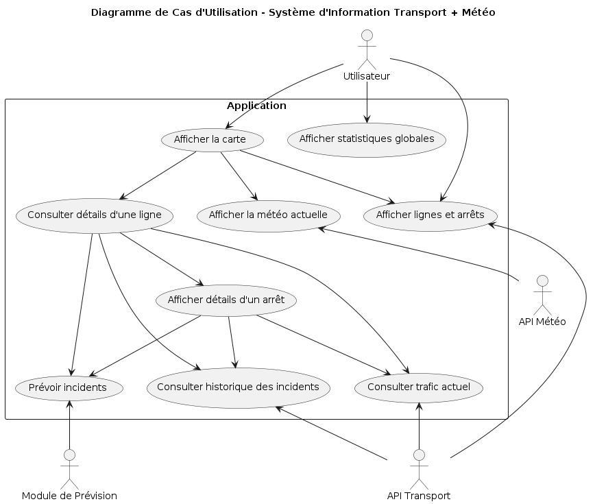
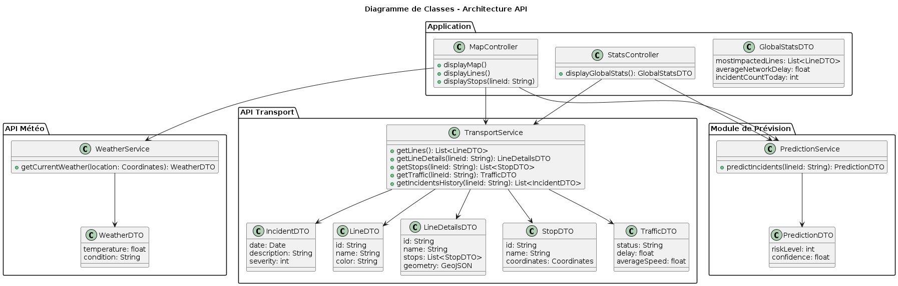
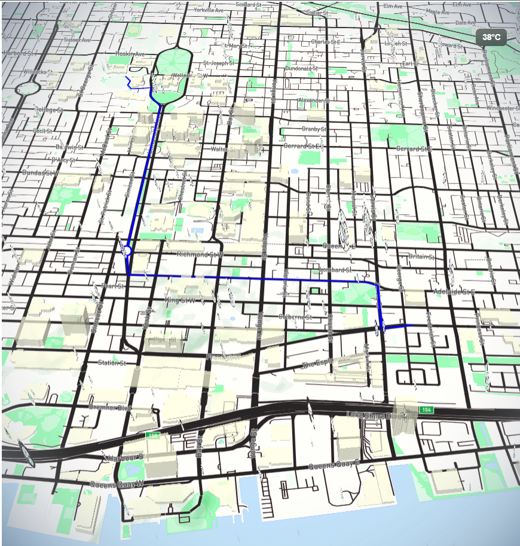
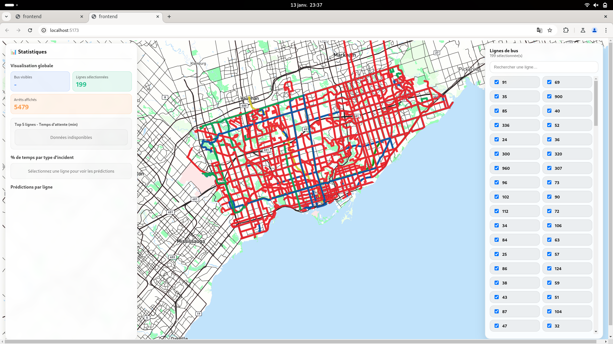

## Introduction

Ce projet vise à concevoir une application permettant de visualiser l’état actuel du réseau de transport urbain, de consulter les conditions météorologiques en temps réel, ainsi que d’analyser des statistiques globales et spécifiques à chaque ligne. L’interface principale repose sur une carte interactive affichant les lignes, les arrêts et des informations dynamiques liées au trafic et aux perturbations.

L’objectif est d’offrir une vision claire, synthétique et contextualisée du réseau afin d’aider les usagers à anticiper leurs déplacements.

### Objectifs Fonctionnels

L’application doit permettre à l’utilisateur de :

- Consulter la météo actuelle sur la zone géographique concernée, incluant les conditions, la température et un indicateur visuel représentatif.

- Visualiser les lignes de bus sur une carte interactive, accompagnées de l’ensemble des arrêts et d’un indicateur d’état (trafic fluide, perturbé ou interrompu).

- Accéder aux informations détaillées d’une ligne, telles que les incidents en cours, les incidents historiques, ainsi que des prévisions de perturbations quand elles sont disponibles.

- Analyser des statistiques globales du réseau, mettant en évidence les lignes les plus impactées, le niveau global de perturbation et les tendances temporelles.

## Diagramme de Cas d'Utilisation

Pour représenter les interactions entre les utilisateurs et le système, un diagramme de cas d'utilisation a été élaboré. Ce diagramme illustre les principales fonctionnalités accessibles aux utilisateurs, telles que la consultation de la météo, la visualisation des lignes de bus, l'accès aux détails des lignes et l'analyse des statistiques.



## Diagramme de Classes

Le diagramme de classes ci-dessous présenta la structure de notre back-end, mettant en évidence les principales entités, leurs attributs et les relations entre elles. Ce diagramme est essentiel pour comprendre comment les données sont organisées et gérées au sein de l'application.
Elle constituera la base pour nos appels API et la gestion des données.
Cette partie est cruciale pour assurer une architecture solide et évolutive de notre application.
Elle a été discutée et validée avec Alexandre Bidaux avant de commencer le développement afin de se mettre d'accord sur la communication entre nos deux TX.



On peut ainsi générer à partir de ce schema notre API RESTful avec les routes suivantes :

https://editor.swagger.io/?url=https://gitlab.utc.fr/clmartin/pr_subway_martins_bidaux/-/blob/app/app/report/APIREST.yaml?ref_type=heads

## Proof of Concept
Avant de s’engager dans la mise en œuvre complète du système, un Proof of Concept (PoC) a été réalisé afin de vérifier la cohérence des choix techniques et la faisabilité des fonctionnalités clés. L’objectif n’était pas de proposer une version exhaustive de l’application, mais de valider étape par étape les principaux éléments qui constituent son cœur fonctionnel.

Le PoC a tout d'abord permis de tester l’intégration d’une carte interactive basée sur __Mapbox GL JS__, affichée au sein d’une application front-end développée avec __React__. Nous avons vérifié la possibilité de représenter dynamiquement des lignes de bus sous forme de tracés géographiques, ainsi que d’ajouter des points d’intérêt tels que les arrêts. Ce premier jalon a servi à confirmer la compatibilité entre les données de coordonnées, la logique de rendu en temps réel et les contraintes de performance liées au navigateur.

De plus Mapbox GL offre une grande flexibilité en termes de personnalisation visuelle, ce qui a permis d’adapter l’apparence de la carte aux besoins spécifiques du projet, notamment en termes de styles et de couches d’information supplémentaires.
Il est aussi possible d’intégrer __des effets visuels avancés__ (pluie et neige) sur la carte et d'y inclure __Three.js__ pour peut-être à terme inclure une visualisation en temps réel des bus en 3D.

La carte personnalisée est accessible ici : https://api.mapbox.com/styles/v1/clementmartins/cmh0o7rch000e01s7g2psbnz8.html?title=view&access_token=pk.eyJ1IjoiY2xlbWVudG1hcnRpbnMiLCJhIjoiY21oMGx4cHAxMDI4bDJuczhnb2N0NHd2ZSJ9.vzFXf89w1P83cru30twuAA&zoomwheel=true&fresh=true#0/0/0
Elle à été faite de façon à faire ressortir les routes et donc mettre en avant les lignes de bus.

Parallèlement, une première couche de back-end a été mise en place à l’aide de Node.js et Express, structurée de manière à évoluer vers une architecture en microservices. Une attention particulière a été portée à l’isolation des clés d’API et des paramètres sensibles via un fichier __.env__, afin de garantir une configuration modulaire et sécurisée.



## Création des routes avec les données GTFS

## Amélioration du rendu et des performances
L’amélioration des performances de l’application cartographique a constitué un axe de travail majeur du projet. L’objectif n’était pas uniquement de rendre l’interface plus fluide, mais surtout de mettre en place une architecture plus cohérente et plus adaptée aux contraintes du rendu cartographique WebGL, tout en conservant les avantages offerts par React pour la gestion de l’interface et de l’état applicatif.

### Analyse de la problématique initiale

Dans la version initiale de l’application, chaque ligne de bus ainsi que chaque arrêt étaient gérés de manière indépendante. Concrètement, cela se traduisait par la création d’une source et d’un layer Mapbox pour chaque ligne, et souvent d’un autre couple source/layer pour les arrêts associés. À cette structure s’ajoutait un composant React dédié par ligne, chargé d’instancier ces éléments graphiques.

Cette approche, bien que conceptuellement simple et proche du paradigme déclaratif de React, s’est révélée inadaptée aux contraintes de Mapbox GL. Le moteur de rendu de Mapbox repose sur WebGL et sur une gestion interne optimisée des couches graphiques. La multiplication des sources et des layers entraînait une surcharge importante du GPU et du CPU, provoquant des ralentissements notables lors du zoom, du déplacement de la carte ou encore lors de la sélection simultanée de plusieurs lignes.

De plus, la synchronisation fine entre le cycle de rendu de React et les opérations impératives de Mapbox (ajout et suppression de layers) augmentait la complexité du code et rendait l’application plus difficile à maintenir et à faire évoluer.


### Principe de refonte retenu

Afin de corriger ces problèmes, une séparation plus nette des responsabilités entre React et Mapbox GL a été mise en place. Le principe fondamental retenu est le suivant :

- React est utilisé pour la gestion de l’état applicatif, la logique métier et l’interface utilisateur (panneau de sélection des lignes, recherche, interactions utilisateur).
- Mapbox GL est responsable exclusivement du rendu graphique et de l’affichage des données géographiques.

Cette séparation permet de conserver une approche déclarative au niveau des données, tout en respectant le fonctionnement impératif et optimisé de Mapbox GL.

### Mutualisation des sources et des layers

L’amélioration la plus significative concerne la gestion des sources et des layers Mapbox. Au lieu de créer un layer par ligne et par arrêt, l’architecture a été repensée autour de la mutualisation :

- Une unique source GeoJSON regroupe l’ensemble des lignes de bus.
- Un seul layer de type `line` est utilisé pour afficher toutes les lignes.
- Une seconde source GeoJSON regroupe l’ensemble des arrêts.
- Un unique layer de type `circle` est dédié à l’affichage des arrêts.

Les lignes et les arrêts sont désormais représentés sous forme de `FeatureCollection` GeoJSON. Chaque entité contient des propriétés descriptives (identifiant de ligne, couleur, nom, etc.) permettant de différencier les éléments et de personnaliser leur apparence sans multiplier les layers.

Cette approche réduit drastiquement le nombre de layers actifs sur la carte, ce qui améliore immédiatement les performances du rendu.

### Mise à jour des données via les sources existantes

Plutôt que de créer et détruire dynamiquement des layers à chaque interaction utilisateur, les mises à jour s’effectuent désormais par le biais de la méthode `setData` des sources GeoJSON existantes.

Lorsqu’un utilisateur sélectionne ou désélectionne une ligne :
- les données GeoJSON correspondantes sont reconstruites côté React,
- les sources Mapbox existantes sont mises à jour avec ces nouvelles données,
- Mapbox se charge automatiquement d’actualiser le rendu graphique.

Ce mécanisme évite les opérations coûteuses liées à la manipulation répétée des layers et s’inscrit dans les bonnes pratiques recommandées par Mapbox GL pour des applications interactives à grande échelle.


### Gestion fiable et performante des sélections

La gestion des lignes sélectionnées repose désormais sur l’utilisation d’identifiants uniques stockés dans une structure de type `Set<string>`. Ce choix permet d’éviter les problèmes liés aux comparaisons par référence d’objets JavaScript, tout en garantissant des opérations de sélection et de désélection rapides et fiables.

Cette représentation s’intègre naturellement aux propriétés des entités GeoJSON et facilite la reconstruction des jeux de données à afficher en fonction de l’état applicatif.


### Allègement du cycle de rendu React

Un autre bénéfice important de cette refonte réside dans la réduction du travail effectué par React lors des mises à jour graphiques. Les éléments visuels lourds (lignes et arrêts) ne sont plus liés directement au cycle de rendu des composants React.

React se limite à :
- mettre à jour l’état global,
- déclencher les reconstructions de données lorsque cela est nécessaire.

Le rendu graphique est entièrement pris en charge par Mapbox GL, ce qui limite les rerenders inutiles et améliore la réactivité globale de l’application.


### Résultats et bénéfices observés

La nouvelle architecture permet d’obtenir plusieurs améliorations notables :
- une fluidité accrue lors de la navigation sur la carte,
- une réduction significative de la charge GPU et CPU,
- une meilleure lisibilité et maintenabilité du code,
- une base technique plus solide pour des optimisations futures telles que le chargement à la demande des lignes, la simplification géométrique ou l’adaptation du niveau de détail en fonction du zoom.

---




## Intégration du service de prédiction des retards

L'un des objectifs majeurs du projet était de permettre aux usagers d'anticiper les perturbations sur le réseau de transport. Pour répondre à cette problématique, un système de prédiction des retards a été développé et intégré à l'application.

### Architecture du système de prédiction

Le système repose sur une architecture en trois couches distinctes :

1. **Modèle de Machine Learning** : Un modèle XGBoost entraîné sur des données historiques combinant informations météorologiques, temporelles et incidents passés.

2. **API de prédiction Python (Flask)** : Un service REST qui expose le modèle via des endpoints HTTP, permettant d'obtenir des prédictions en temps réel.

3. **Intégration Front-end et Back-end** : Une couche TypeScript qui orchestre les appels au service de prédiction et présente les résultats de manière claire aux utilisateurs.

### Modèle de prédiction simplifié

Le modèle a été optimisé pour garantir à la fois performance et simplicité. Il utilise :

- **Encodage cyclique** pour les variables temporelles (heure, jour de la semaine, mois, direction du vent), préservant leur nature périodique.
- **Transformation des variables météorologiques** : regroupement des conditions météo similaires, binarisation des précipitations, catégorisation de la visibilité.
- **Prétraitement standardisé** via un pipeline scikit-learn sauvegardé (preprocessor.pkl).

### API de prédiction

L'API Flask (`app.py`) expose un endpoint :

**Prédiction de retard**
```
POST /predict
```
Accepte des données météorologiques et temporelles, retourne une estimation du retard en minutes.

L'API utilise CORS pour permettre les appels depuis le front-end et inclut une validation complète des données d'entrée pour garantir la fiabilité des prédictions.

### Intégration Backend (TypeScript/Node.js)

Le backend TypeScript fait office d'intermédiaire entre le front-end et le service Python :

- **Service de prédiction** (`predictionService.ts`) : Gère la communication avec l'API Flask, incluant la gestion d'erreurs et la vérification de santé.

- **Routes REST** (`busRoutes.ts`) : Expose un endpoint `POST /lines/:id/prediction/:incident` permettant d'obtenir des prédictions pour une ligne et un incident spécifique.

- **Service de lignes** (`busService.ts`) : Intègre les appels de prédiction dans la logique métier existante.

L'URL de l'API de prédiction est configurable via la variable d'environnement `PREDICTION_API_URL`.

### Intégration Frontend (React)

Côté interface utilisateur, les prédictions sont intégrées dans le panneau de statistiques :

- **Service de prédiction** (`PredictionService.tsx`) : Encapsule les appels API vers le backend.

- **Panneau de statistiques** (`StatsPanel.tsx`) : 
  - Charge automatiquement les prédictions lorsqu'une ligne est sélectionnée
  - Affiche le retard prédit en minutes pour chaque ligne

- **Styles** (`StatsPanel.module.css`) : Une section dédiée présente les retards prédits avec un design cohérent (badge coloré, bordures arrondies).

### Flux de données

1. L'utilisateur sélectionne une ou plusieurs lignes de bus sur la carte
2. Le frontend récupère les données météorologiques actuelles
3. Pour chaque ligne sélectionnée, un appel API est effectué vers le backend
4. Le backend transmet la requête au service Python de prédiction
5. Le modèle XGBoost génère une prédiction de retard
6. Le résultat remonte jusqu'au frontend
7. Les prédictions sont affichées dans le panneau de statistiques avec un design adapté

### Avantages de cette architecture

- **Séparation des préoccupations** : Le modèle ML reste en Python (écosystème optimal), tandis que la logique applicative est en TypeScript.
- **Scalabilité** : Le service de prédiction peut être déployé indépendamment et répliqué selon les besoins.
- **Maintenabilité** : Chaque couche peut être modifiée sans impacter les autres.
- **Extensibilité** : D'autres modèles ou sources de données peuvent être ajoutés facilement.

## Guide d'utilisation

### Démarrage de l'application complète

Pour bénéficier des prédictions de retard, l'application nécessite le démarrage de trois services :

**1. Service de prédiction Python**
```bash
cd models
pip install -r requirements.txt
python prediction_api.py
```
Le service démarre par défaut sur `http://localhost:5000`.

**2. Backend Node.js**
```bash
cd app/backend
npm install
npm start
```
Le backend démarre sur le port 3000 et communique avec le service de prédiction.

**3. Frontend React**
```bash
cd app/frontend
npm install
npm run dev
```
L'interface utilisateur est accessible sur `http://localhost:5173`.
(A condition de spécifié les token nécessaire pour les API dans les __.en__ de chaque module):
- FrontEnd: VITE_MAPBOX_ACCESS_TOKEN et VITE_API_BASE_URL
- Backend: MAPBOX_ACCESS_TOKEN, PORT, PREDICTION_API_URL, BASELINE_LINE_FOR_PREDICTIONS, WEATHER_API_URL, WEATHER_API_KEY

### Utilisation de la fonctionnalité de prédiction

1. Ouvrez l'application dans votre navigateur
2. Sur la carte interactive, sélectionnez une ou plusieurs lignes de bus en utilisant le panneau latéral gauche
3. Le panneau de statistiques à droite affiche automatiquement :
   - Les statistiques globales du réseau
   - Les prédictions par type d'incident
   - **Les retards prédits en minutes pour chaque ligne sélectionnée**

Les prédictions sont calculées en temps réel en tenant compte des conditions météorologiques actuelles et de l'heure de la journée.

## Intégration du service de données météorologiques

Pour améliorer la précision et la fiabilité du système de prédiction, un services majeurs a été développés :
1. **Service de données météorologiques** : Fournit des données météorologiques réelles au système prédictif.

### Architecture du Service Météorologique

Le service météorologique repose sur l'api :https://www.meteosource.com/

**Backend (`weatherService.ts`)** :
- Récupère les données actuel à Toronto via l'API.
- Implémente un système de cache pour optimiser les performances (1 heure)
- Expose le format de données spécifié par le système prédictif:

**API REST** :
- `GET /weather/current` : Récupère les conditions météorologiques actuelles

**Frontend (`WeatherService.tsx`)** : Encapsule les appels API et fournit des méthodes pour récupérer les données météorologiques.

```typescript
export type WeatherData = {
    TEMP: number;
    DEW_POINT_TEMP: number;
    HUMIDEX: number | null;
    PRECIP_AMOUNT: number;
    RELATIVE_HUMIDITY: number;
    STATION_PRESSURE: number;
    VISIBILITY: number;
    WEATHER_ENG_DESC: string;
    WIND_DIRECTION: number | null;
    WIND_SPEED: number | null;
    LOCAL_DATE: string;
    LOCAL_TIME: string;
    WEEK_DAY: string;
    LOCAL_MONTH: number;
    LOCAL_DAY: number;
}
```

## Déploiement sur Raspberry Pi

Afin de valider la faisabilité d’un déploiement sur une plateforme embarquée à faible consommation, l’ensemble de l’application a été installé et configuré sur un **Raspberry Pi**. Cette étape permet de démontrer que l’architecture retenue est suffisamment légère, robuste et modulaire pour fonctionner sur un matériel contraint, tout en restant accessible depuis le réseau local et Internet.

### Choix de la plateforme

Le Raspberry Pi a été retenu pour plusieurs raisons :

- faible consommation énergétique, adaptée à un fonctionnement continu,
- large compatibilité avec les technologies Web modernes (Node.js, Python, Nginx),
- disponibilité d’interfaces réseau et de stockage avancées (NVMe),
- pertinence pédagogique pour illustrer un déploiement proche des conditions réelles.

Et surtout disponible chez moi.

Le système d’exploitation utilisé est **Ubuntu Server 24.04 LTS (ARM64)**, offrant un compromis entre stabilité, mises à jour de sécurité et compatibilité logicielle.

### Organisation du stockage

Le système repose sur une organisation hybride :

- **Carte SD** : utilisée uniquement pour le démarrage du système et les fichiers critiques de l’OS.
- **SSD NVMe** : utilisé pour stocker l’intégralité du projet applicatif.

Cette séparation permet :
- de limiter l’usure de la carte SD,
- d’améliorer les performances d’accès disque,
- de sécuriser le stockage applicatif.

Le NVMe est monté dans le répertoire : /mnt/nvme

L’application est installée dans : /mnt/nvme/pr_subway_martins_bidaux/


### Déploiement des services applicatifs

L’application est composée de trois services principaux :

1. **Frontend React (build statique)**  
   - Généré via Vite (`npm run build`)
   - Servi par Nginx
   - Aucun serveur de développement exposé

2. **Backend Node.js**  
   - Fournit les routes REST liées aux données de transport
   - Écoute uniquement sur `127.0.0.1:3000`

3. **API de prédiction Python (Flask)**  
   - Héberge le modèle de machine learning
   - Utilise un environnement virtuel Python (`venv`) afin de respecter les contraintes PEP 668
   - Écoute uniquement sur `127.0.0.1:5000`

Ces services sont isolés et communiquent uniquement via des interfaces locales, renforçant la sécurité globale du système.

### Utilisation de Nginx comme point d’entrée unique

Nginx est utilisé comme **reverse proxy central**, jouant un rôle clé dans l’architecture :

- exposition de l’application via le port HTTP standard (80),
- redirection des requêtes vers les services internes,
- suppression de l’exposition directe des ports applicatifs.

Les routes sont organisées de la manière suivante :

| Route | Service associé |
|------|----------------|
| `/` | Frontend React |
| `/api` | Backend Node.js |
| `/predict` | API Python de prédiction |

Grâce à cette approche, le frontend communique avec les backends via des chemins relatifs, garantissant un fonctionnement identique en réseau local et via Internet.

### Démarrage automatique et stabilité

Pour assurer un fonctionnement continu, chaque composant est géré par un **service systemd** :

- démarrage automatique au boot,
- redémarrage en cas de défaillance,
- contrôle centralisé via `systemctl`.

L’API Python utilise explicitement l’interpréteur de l’environnement virtuel afin de garantir la cohérence des dépendances.

### Accès à l’application

Depuis le réseau local, l’application est accessible via :http://IP_DU_RASPBERRY


Pour un accès depuis Internet, une redirection NAT est configurée sur la box :

- port externe : 8080
- port interne : 80 (Raspberry Pi)

Les ports internes (3000, 5000, 5173) ne sont jamais exposés, conformément aux bonnes pratiques de sécurité.
